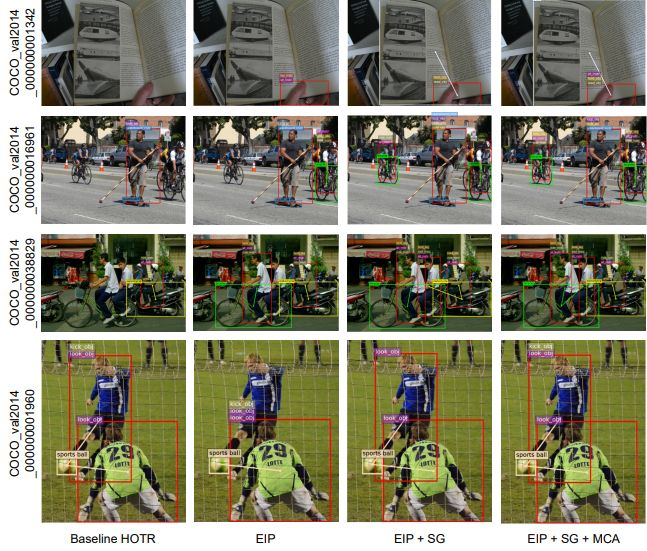
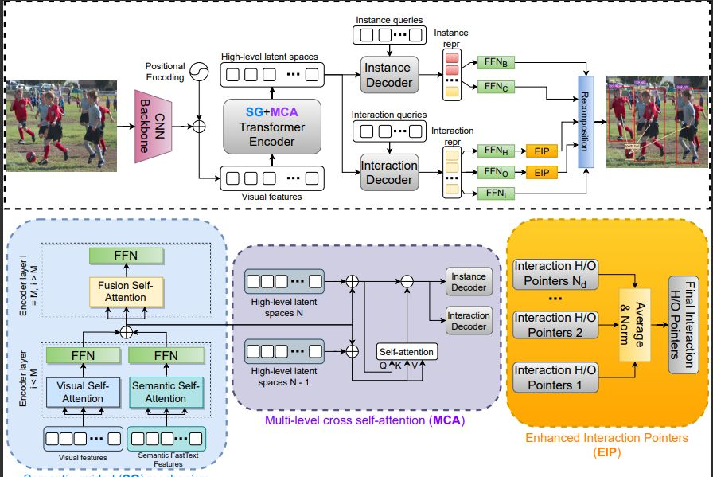

# Improving Human-object Interaction with Auxiliary Semantic Information and Enhanced Instance Representation
In this study, we improve the performance of human-object interaction based on an end-to-end Transformer-based model called HOTR. In detail, we propose a simple but effective mechanism for enhancing the instances representation; moreover the semantic information is also explored to provide more knowledge; and finally, the cross-attention is proposed to fuse multi-level high-level feature maps in the Transformer architecture.
The study achieves a significant improvement compared to the baseline HOTR model and is very competitive with other models
<p align="center"></p>

We proposed three modules.: Enhanced Instance Pointers, Semantic-guided Mechanism, Multi-level cross-attention

<p align="center"></p>


## 1. Environmental Setup
We experimented three modules in colab environmental 
```bash
!pip install torch==1.7.1+cu110 torchvision==0.8.2+cu110 torchaudio==0.7.2 -f https://download.pytorch.org/whl/torch_stable.html
!pip install cython scipy
!pip install pycocotools
!pip install opencv-python
!pip install wandb
```


## 2. How to Train/Test
For both training and testing, you can either run on a single GPU or multiple GPUs.
```bash
# Train from epoch 1
!python main.py \
		--group_name vcoco \
		--run_name vcoco_single_run_000001 \
		--HOIDet \
		--validate  \
		--share_enc \
		--pretrained_dec \
		--lr 1e-4 \
		--num_hoi_queries 16 \
		--set_cost_idx 10 \
		--hoi_act_loss_coef 10 \
		--hoi_eos_coef 0.1 \
		--temperature 0.05 \
		--no_aux_loss \
		--hoi_aux_loss \
		--dataset_file vcoco \
		--frozen_weights https://dl.fbaipublicfiles.com/detr/detr-r50-e632da11.pth \
		--data_path /v-coco/data  \
		--output_dir  /checkpoints

# To train from a resume epoch
!python main.py \
		--group_name HOTR_vcoco \
		--run_name vcoco_single_run_000001 \
		--HOIDet \
		--validate \
		--share_enc \
		--pretrained_dec \
		--lr 1e-4 \
		--num_hoi_queries 16 \
		--set_cost_idx 10 \
		--hoi_act_loss_coef 10 \
		--hoi_eos_coef 0.1 \
		--temperature 0.05 \
		--no_aux_loss \
		--hoi_aux_loss \
		--dataset_file vcoco \
		--frozen_weights https://dl.fbaipublicfiles.com/detr/detr-r50-e632da11.pth \
    		--resume checkpoints/HOTR_vcoco/vcoco_single_run_000001/checkpoint99.pth \
    		--start_epoch 99 \
		--data_path /v-coco/data  \
		--output_dir  checkpoints
```

For testing, you can use your own trained weights and pass the group name and run name to the 'resume' argument.
```bash
!python main.py \
		--HOIDet \
		--share_enc \
		--pretrained_dec \
		--num_hoi_queries 16 \
		--object_threshold 0 \
		--temperature 0.05 \
		--no_aux_loss \
		--eval \
		--dataset_file vcoco \
		--data_path /v-coco/data \
		--resume /checkpoints/checkpoint99.pth
```
In order to use our provided weights, you can download the weights provided below.
Then, pass the directory of the downloaded file (for example, to test our pre-trained weights on the vcoco dataset, we put the downloaded weights under the directory checkpoints/vcoco.pth) to the 'resume' argument.

## 4. Results
Here, we provide improved results of V-COCO Scenario 1 (58.9 mAP, 0.5ms) and HICO-DET Default(Full) (23.76 mAP) from the version of our initial submission (55.2 mAP & 23.46 mAP, 0.9ms).
This is obtained "without" applying any priors on the scores (see [iCAN](https://github.com/vt-vl-lab/iCAN/blob/83a363cfc80bf62538d5faf6ec17c871686c0635/lib/ult/apply_prior.py)).
The fine-tuned version of HICO-DET can be obtained by only fine-tuning the FFN layers of the instance decoder (without the need of fully training the entire encoder-decoder).

# queries | Scenario 1   | Scenario 2  | Checkpoint   |
|:-------:|:------------:|:-----------:|:------------:|
|    16   |     60.88     |     65.69    | [download](https://drive.google.com/file/d/1qhi5Qi6fh6rV5uBOQ09DBOcW7lroRZ1I/view)  |

```
